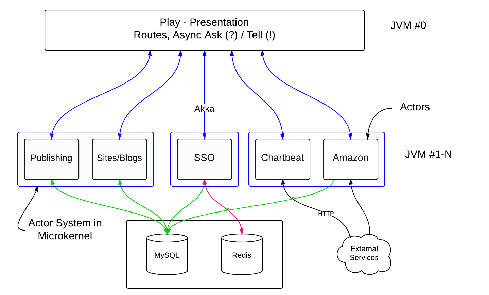

# Akka 
Akka 是基於 Actor 模型以 Scala 程式語言開發而成的開源工具，被用在建置可擴展、彈性、高度並行、分散式與快速響應的 JVM 應用程式平台。現在許多高度並行（Concurrent） JVM 應用程式被廣泛應用，尤其以巨量資料處理框架為甚，諸如：Spark、Storm等，甚至可以基於 Akka 建置高平行的 Web 框架，更能建置分散式系統。Akka 最主要的目是要解決同步造成的效能問題，以及可能發生的死鎖問題。

Akka 目前擁有以下幾個特點：
* 高度並行與分散式
* 可擴展
* 擁有容錯機制
* 去中心化，且彈性
* 基於 Actors 模型
* 事務性 Actors
* 支援 JAVA 與 Scala API。
* 支援叢集

Akka 是基於 [Actor](https://zh.wikipedia.org/wiki/%E5%8F%83%E8%88%87%E8%80%85%E6%A8%A1%E5%BC%8F) 模型來開發，透過 Actor 能夠簡化死鎖與執行緒管理，可以非常容易開發正確並行化行程與系統，在 Akka 中 Actor 是最基本、最重要的元素，被用來完成工作。Actor 具有以下特性：
* 提供高級別的抽象，能簡化在並行（Concurrency）/平行（Parallelism）應用下的程式開發。
* 提供異步（Async）非阻塞、高效能的事件驅動程式模型。
* 非常輕量的事件處理（每 GB Heap 記憶體有幾百萬的 Actor）


<center>  

Actor 是一個運算實體，在開發程式中就是對實體之間所回應接受到的訊息做互動，同時並行的```傳送有限數量的訊息給其他 Actor```、```建立有限數量的 Actor``` 以及```設計指定接收到下一個訊息時的行為```。

Actor 之間是獨立的，多個 Actor 進行互動只能透過自定的訊息（Message）來完成發送與接收處理。如果一個 Actor 在某一個時刻收到多個 Actor 發送的訊息，就會發生並行問題，這時就需要一個訊息佇列來進行訊息的儲存與分散。可參考 [Akka 為範例，介紹 Actor 模型](http://www.infoq.com/cn/news/2014/11/intro-actor-model)。


Akka 應用場景有以下幾個項目，當然這不是全部：
* 交易處理（Transaction Processing）
* 後端服務（Backend Service）
* 平行運算（Concurrency/Parallelism）
* 通訊 Hub（Communications Hub）
* 複雜事件串流處理（Complex Event Stream Processing）

## 安裝
Akka 一般在 Java 有兩種安裝方式，如以下：
* 當作 Library 使用，就是直接 Import JAR 使用。可參考 [Java Documentation](http://doc.akka.io/docs/akka/2.4.2/java.html?_ga=1.230769695.1061481694.1456285775)。
* 將應用放到獨立的微核心（Microkernel）裡使用。可參考 [Microkernel](http://doc.akka.io/docs/akka/2.3.10/scala/microkernel.html)。

## 簡單範例

