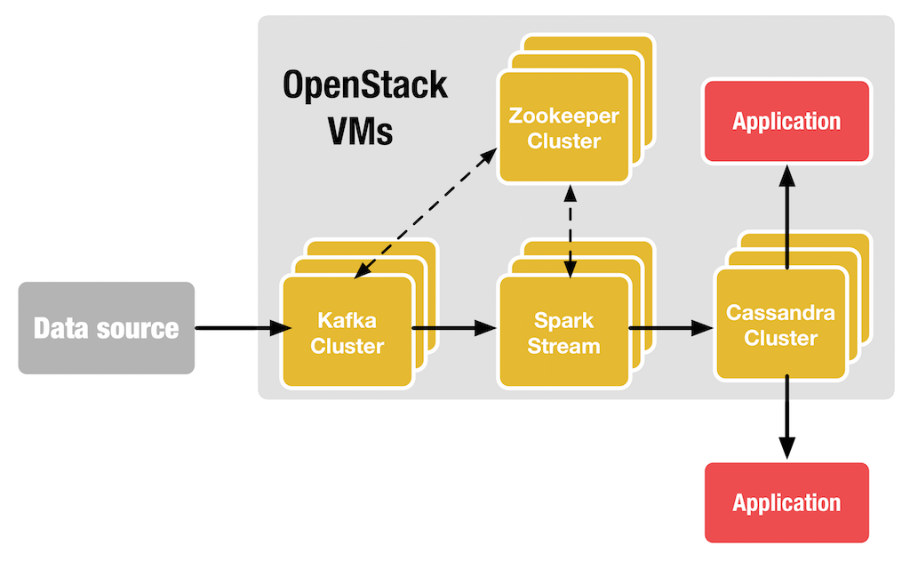

# Apache Kafka 
Apache Kafka 是一個分散式的訊息佇列框架，是由 LinkedIn 公司使用 Scala 語言開發的系統，被廣泛用來處理高吞吐量與容易水平擴展，目前許多巨量資料運算框架以都有整合 Kafka，諸如：Spark、Cloudera、Apache Storm等，

Kafka 是基於```Publish/Subscribe```的訊息系統，主要設計由以下特點：
* 在 TB 級以上資料也能確保常數時間複雜度的存取效能，且時間複雜度為O(1)的訊息持久化。
* 高吞吐量，在低階的商業電腦上也能提供單機```100k/sec```條以上的訊息傳輸。
* 支援 Kafka Server 之間的訊息分區(Partition)以及分散式發送，並保證每個分區內的訊息循序傳輸。
* 同時支援離線資料處理與即時資料處理
* 容易的服務不中斷水平擴展。

Kafka 從架構上來看，Kafka 會擁有以下幾個角色：
* **Producer**：主要為 Publish 訊息到 Topic。
* **Consumer**：主要為 Subscribe Topic 來取得訊息。
* **Broker**：訊息的中介者，可看錯是一台訊息 Server，可部署單機至多台叢集。
* **Topic**：拿來做訊息的分類。
* **Zookeeper**：Zookeeper 不算是 Kafka 一員，但 Kafka 依賴 Zookeeper 來做到 Sync。

<center>  

Apache Kafka 的一個簡單應用架構可以參考下圖，透過 Spark Streaming 來進行串接做快速的串流資料收集，並利用 Spark 框架進行分析後取得結果存於 Cassandra 資料庫叢集，最後在由應用程式或前端網頁來顯示處理過的資料：

<center> 


## 安裝 Apache Kafka
一個簡單的節點配置如下：

| IP Address  |   Role   | zookeeper id | broker.id |
|-------------|----------|--------------|-----------|
|172.17.0.2   |  kafka-1 |       1      |     0     |
|172.17.0.3   |  kafka-2 |       2      |     1     |
|172.17.0.4   |  kafka-3 |       3      |     2     |

首先要在每台節點安裝 Java，這邊採用 Oracle 的 Java 來進行安裝：
```sh
$ sudo apt-get install -y software-properties-common 
$ sudo add-apt-repository -y ppa:webupd8team/java
$ sudo apt-get update
$ echo debconf shared/accepted-oracle-license-v1-1 select true | sudo debconf-set-selections
$ echo debconf shared/accepted-oracle-license-v1-1 seen true | sudo debconf-set-selections
$ sudo apt-get -y install oracle-java7-installer
```
> 若要安裝```java8```請修改成```oracle-java8-installer```。

完成後，接著在每台節點安裝 Zookeeper 服務，這邊採用```apt-get```來進行安裝：
```sh
$ sudo apt-get install -y zookeeperd
```
> 完成安裝後，zookeeper 會自動開啟服務於 port 2181。若沒啟動使用以下指令：
```sh
$ sudo service zookeeper restart
```

> 若想部署多節點 Zookeeper，請修改每台節點的```/etc/zookeeper/conf/zoo.cfg```檔案，加入以下內容：(Option) 
```sh
server.1=172.17.0.2:2888:3888
server.2=172.17.0.3:2888:3888
server.3=172.17.0.4:2888:3888
```
> 並設定 ID，如下指令：
```sh
$ echo "1" | sudo tee /etc/zookeeper/conf/myid
```

測試 Zookeeper 是否啟動，可以透過 Telnet 來進行：
```sh
$ telnet localhost 2181
```

當節點上述完成後就可以下載 Kafka 套件，這邊採用```curl```來下載，並解壓縮到```/opt/```底下：
```sh
$ sudo curl -s http://ftp.tc.edu.tw/pub/Apache/kafka/0.9.0.1/kafka_2.10-0.9.0.1.tgz | sudo tar -xz -C /opt/
$ sudo mv /opt/kafka_2.10-0.9.0.1 /opt/kafka
```

下載完成後，編輯```/opt/kafka/config/server.properties```，並加入以下內容：
```sh
# The id of the broker. This must be set to a unique integer for each broker.
broker.id=0

host.name=172.17.0.2

zookeeper.connect=172.17.0.2:2181,172.17.0.3:2181,172.17.0.4:2181
```
> ```P.S``` 這邊的```broker.id```需跟著節點數變動，從 0  開始計數。


編輯完以後就分別啟動這三台 Broker：
```sh
$ cd /opt/kafka
$ bin/kafka-server-start.sh config/server.properties &
```

## 驗證服務
當所有 Server 啟動完成後，就可以透過建立 Topic 來確認是否成功部署完成：
```sh
$ /opt/kafka/bin/kafka-topics.sh --create \
--zookeeper localhost:2181 \
--replication-factor 3 \
--partitions 1 \
--topic test
```
> 可以試著將```--replication-factor```改為 4，若成功會看到以下錯誤訊息：
```
replication factor: 4 larger than available brokers: 3
```
原因是我們只有建立 3 台叢集。

建立完成後，可以用以下指令查看：
```sh
$ /opt/kafka/bin/kafka-topics.sh --describe --zookeeper localhost:2181 --topic test

# 會看到類似以下資訊
Topic:test	PartitionCount:1	ReplicationFactor:3	Configs:
	Topic: test2	Partition: 0	Leader: 2	Replicas: 2,0,1	Isr: 2,0,1
```

接下來透過 Publish 來傳送訊息：
```sh
$ /opt/kafka/bin/kafka-console-producer.sh \
--broker-list localhost:9092 \
--topic test

# 輸入
ggeeder
ggeeder
```

接著就要讀取訊息，透過 Subscribe 來訂閱收取資料：
```sh
$ /opt/kafka/bin/kafka-console-consumer.sh \
--zookeeper 172.17.0.2:2181,172.17.0.3:2181 \
--topic test \
--from-beginning
```

測試 replication 是否有正確運作，我們可以看到上面範例 Leader 為 2，這時透過手動方式關閉該 broker：
```sh
$ jps
83 Kafka

$ sudo kill -9 83
```

接著可以先去看該 Topic 的 Leader 是否有變化：
```sh
$ /opt/kafka/bin/kafka-topics.sh --describe --zookeeper localhost:2181 --topic test
```

此時看 Consume message，會發現訊息應該還是會保存的完整無缺：
```sh
$ /opt/kafka/bin/kafka-console-consumer.sh --zookeeper localhost:2181 --from-beginning --topic test
```