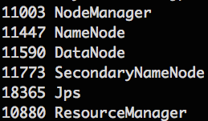

# Ubuntu 單機安裝
### 安裝ssh-server
```sh
sudo apt-get install openssh-server
```

### 設定<user>(hadoop)不用再打sudo密碼
```sh
echo "hadoop ALL = (root) NOPASSWD:ALL" | sudo tee /etc/sudoers.d/hadoop && sudo chmod 440 /etc/sudoers.d/hadoop
```

### 建立ssh key
```sh
ssh-keygen -t rsa
```
### 複製ssh不需要密碼登入
```sh
ssh-copy-id localhost
```
### 安裝Java 1.7 JDK
```sh
sudo apt-get purge openjdk*
sudo apt-get -y autoremove
sudo add-apt-repository -y ppa:webupd8team/java
sudo apt-get update
echo debconf shared/accepted-oracle-license-v1-1 select true | sudo debconf-set-selections
echo debconf shared/accepted-oracle-license-v1-1 seen true | sudo debconf-set-selections
sudo apt-get -y install oracle-java7-installer
```
### 下載Hadoop 2.5.2 or laster version
```sh
wget http://ftp.tc.edu.tw/pub/Apache/hadoop/common/hadoop-2.5.2/hadoop-2.5.2.tar.gz
```
### 解壓縮Hadoop 2.5.2，並搬移到/opt底下
```sh
tar xvf hadoop-2.5.2.tar.gz
sudo mv hadoop-2.5.2 /opt/hadoop
```
### 到hadoop底下的/etc/hadoop設定所有conf檔與evn.sh檔
```sh
cd /opt/hadoop/etc/hadoop
sudo vim hadoop-env.sh
# 修改裡面的Java_Home
export JAVA_HOME=/usr/lib/jvm/java-7-oracle
```
### 修改mapred-site.xml.template檔案
```sh
sudo mv mapred-site.xml.template mapred-site.xml
sudo vim mapred-site.xml

# 修改以下放置到<configuration></configuration>裡面
<property>
   <name>mapreduce.framework.name</name>
   <value>yarn</value>
</property>
```
### 修改hdfs-site.xml檔案(注意修改 /home/<你的usr名稱>)
```sh
sudo vim hdfs-site.xml

# 修改以下放置到<configuration></configuration>裡面
<property>
   <name>dfs.replication</name>
   <value>1</value>
</property>
<property>
   <name>dfs.namenode.name.dir</name>
   <value>/home/kairen/hadoop_store/hdfs/namenode</value>
</property>
<property>
   <name>dfs.datanode.data.dir</name>
   <value>/home/kairen/hadoop_store/hdfs/datanode</value>
</property>
```
### 修改core-site.xml檔案(注意修改 /home/<你的usr名稱>)
```sh
sudo vim core-site.xml

# 修改以下放置到<configuration></configuration>裡面
    <property>
        <name>fs.defaultFS</name>
        <value>hdfs://localhost:9000</value>
    </property>
    <property>
        <name>hadoop.tmp.dir</name>
        <value>/home/kairen/hadoop-tmp</value>
        <description>A base for other temporary directories.</description>
    </property>
```
### 修改yarn-site.xml檔案
```sh
sudo vim yarn-site.xml

# 修改以下放置到<configuration></configuration>裡面
 <property>
        <name>yarn.nodemanager.aux-services</name>
        <value>mapreduce_shuffle</value>
</property>
```
### 進行Namenode 格式化
```sh
cd /opt/hadoop/bin
./hadoop namenode -format
```
### 沒出錯的話，就可以開啟Hadoop對應服務
```sh
cd /opt/hadoop/sbin
./start-yarn.sh
./start-dfs.sh
```
### 檢查是否開啟以下服務
```sh
jps
```

> 開啟[Website YARN Dashboard](localhost:8088)與[HDFS Dashboard](localhost:50070)

### 設定環境變數
```sh
cd
sudo vim .bashrc
# 加入以下到最後一行

export HADOOP_BIN="/opt/hadoop/bin"
export PATH=$PATH:$HADOOP_BIN
```
### source 環境變數
```sh
source .bashrc
```
# Example 程式執行
### 上傳資料到HDFS上
```sh
touch words.txt
sudo vim words.txt

# 加入以下，可以自行在多加
AA
CD
BB
DE
AA
AA
# 加入以上

hadoop fs -mkdir /example
hadoop fs -put words.txt /example
```
### 執行範例程式
```sh
cd /opt/hadoop/share/hadoop/mapreduce
hadoop jar hadoop-mapreduce-examples-2.5.2.jar wordcount /example/words.txt /example/output
```

# Script 單機自動安裝
* [Hadoop 2.6.0 Install Script](https://drive.google.com/file/d/0BzswQSU8BamBcG43TmdoNUo2ODQ/view?usp=sharing)

