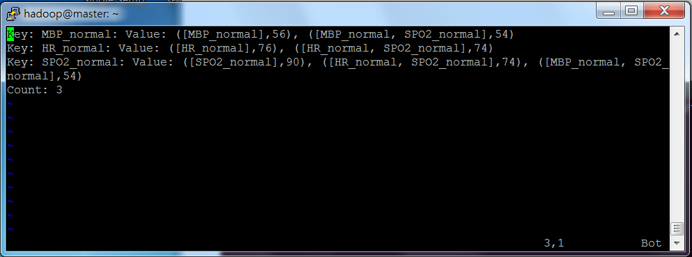

# Mahout


### 簡介


 
Mahout 是一套具有可擴充能力的機器學習類庫。它提供機器學習框架的同時，還實現了一些可擴展的機器學習領域經典算法的實現，可以幫助開發人員更加方便快捷地創建智能應用程序。通過和 Apache Hadoop 分布式框架相結合，Mahout 可以有效地使用分布式系統來實現高性能計算。


### 推薦演算法

通過分析用戶的使用行为的曆史記錄來推算用戶最可能喜歡的商品、服務、套餐的相關物品。實現時可以基於用戶的推薦(通過查找相似的用戶來推薦項目)或基於項目的推薦(計算項目之間的相似度並做出推薦)。 

### 分群演算法

通過分析將一系列相關的物品等劃分为相關性相近的群組。 。 


### 分類演算法

通過分析一組已經分類的物品，將其他未分類的其他物品按同样規則歸入相應的分類。 


### 關聯式分析

識別出一系列經常一起出現的物品組(經常一起查詢、放入購物 車等)。 


#Kmeans


**資料來源**(http://archive.ics.uci.edu/ml/databases/synthetic_control/synthetic_control.data)


```
28.7812 34.4632 31.3381 31.2834 28.9207 33.7596 25.3969 27.7849 35.2479 27.1159 32.8717 29.2171 36.0253 32.337 
34.5249 32.8717 34.1173 26.5235 27.6623 26.3693 25.7744 29.27   30.7326 29.5054 33.0292 25.04   28.9167 24.3437 
26.1203 34.9424 25.0293 26.6311 35.6541 28.4353 29.1495 28.1584 26.1927 33.3182 30.9772 27.0443 35.5344 26.2353 
28.9964 32.0036 31.0558 34.2553 28.0721 28.9402 35.4973 29.747  31.4333 24.5556 33.7431 25.0466 34.9318 34.9879 


```

**準備**

```
hadoop dfs -mkdir testdata     (創建後的路径为:/user/hadoop/testdata)
hadoop fs -put /home/hadoop/mahout/mahout-distribution-0.7/synthetic_control.data testdata
```

**指令**

```
hadoop jar $MAHOUT_HOME/mahout-examples-0.7-job.jar org.apache.mahout.clustering.syntheticcontrol.kmeans.Job

```

**結果**

```
(運行結果保存在:/user/hadoop/output)
```

**觀看結果**

```
mahout vectordump -i /user/hadoop/output/data/part-m-00000 -o /home/hadoop/data/result_data.txt

mahout seqdumper -i /user/hadoop/output/clusters-2/part-r-00000 -o /home/hadoop/data/result_clusters2.txt

mahout clusterdump --input /user/hadoop/output/clusters-0 --pointsDir /user/hadoop/output/clusteredPoints --output /home/hadoop/data/result_clusters0.txt

```

#Recommend


**說明**

user x book 評價表(5為最高評價，1為最低評價) 

|       | book1 | book2  | book3 |
| --    | --  | -- | --  |
| user1 | 5   | 4  | 5   |
| user2 | 4   | 5  | 4   |
| user3 | 5   | 4  |     |
| user4 | 1   | 2  |     |
| user5 | 1   | 1  | 1   |

**資料格式**

```
1,1,5
1,2,4
1,3,5
2,1,4
2,2,5
2,3,4
3,1,5
3,2,4
4,1,1
4,2,2
5,1,2
5,2,1
5,3,1

```

**準備**

```
hadoop dfs -mkdir testdata     (創建後的路径为:/user/hadoop/testdata)
hadoop fs -put /home/hadoop/mahout/mahout-distribution-0.7/synthetic_control.data testdata

```

**指令**


```
mahout recommenditembased -i testdata -o output -s SIMILARITY_EUCLIDEAN_DISTANCE
```

**結果**

預測 

3 : 4~5  
4 : 1~2


```
3 [3:4.4787264]
4 [3:1.5212735]
```


#fpGrowth

**資料格式**

```
HR_higher,SBP_normal,DBP_lower,MBP_normal,RR_lower,SPO2_normal
HR_normal,SBP_higher,DBP_normal,MBP_higher,RR_normal,SPO2_normal
HR_normal,SBP_normal,DBP_higher,MBP_higher,RR_normal,SPO2_normal
HR_normal,SBP_normal,DBP_lower,MBP_lower,RR_lower,SPO2_normal
HR_higher,SBP_normal,DBP_normal,MBP_normal,RR_normal,SPO2_normal
HR_normal,SBP_normal,DBP_lower,MBP_normal,RR_lower,SPO2_normal
HR_normal,SBP_normal,DBP_lower,MBP_normal,RR_lower,SPO2_normal
HR_higher,SBP_higher,DBP_normal,MBP_normal,RR_lower,SPO2_normal
HR_higher,SBP_higher,DBP_higher,MBP_higher,RR_lower,SPO2_normal
HR_normal,SBP_higher,DBP_normal,MBP_normal,RR_normal,SPO2_normal
HR_normal,SBP_higher,DBP_normal,MBP_higher,RR_normal,SPO2_normal
HR_normal,SBP_normal,DBP_lower,MBP_normal,RR_lower,SPO2_lower
HR_normal,SBP_higher,DBP_lower,MBP_normal,RR_normal,SPO2_normal
HR_normal,SBP_normal,DBP_normal,MBP_normal,RR_lower,SPO2_normal
HR_normal,SBP_higher,DBP_higher,MBP_higher,RR_normal,SPO2_normal
HR_normal,SBP_higher,DBP_normal,MBP_normal,RR_lower,SPO2_normal
HR_normal,SBP_normal,DBP_lower,MBP_lower,RR_lower,SPO2_normal

```

**準備**

```
hadoop dfs -mkdir testdata     (創建後的路径为:/user/hadoop/testdata)
hadoop fs -put /home/hadoop/mahout/mahout-distribution-0.7/synthetic_control.data testdata

```

**指令**

```
hadoop jar ../mahout/mahout-distribution-0.9/mahout-examples-0.9-job.jar org.apache.mahout.fpm.pfpgrowth.FPGrowthDriver -i /user/hadoop/testdata/history_download -o out -k 3 -s 50 -method mapreduce  -s 10

```

**結果**

```
(運行結果保存在:/user/hadoop/output)

```

**觀看結果**

```
mahout seqdumper -i /user/hadoopout/out -o /home/hadoop/result_points.txt

```




### 參考

http://fanli7.net/a/bianchengyuyan/C__/20121116/254817.html

http://systw.net/note/af/sblog/more.php?id=294

http://f.dataguru.cn/thread-379178-1-1.html

https://chimpler.wordpress.com/2013/05/02/finding-association-rules-with-mahout-frequent-pattern-mining/