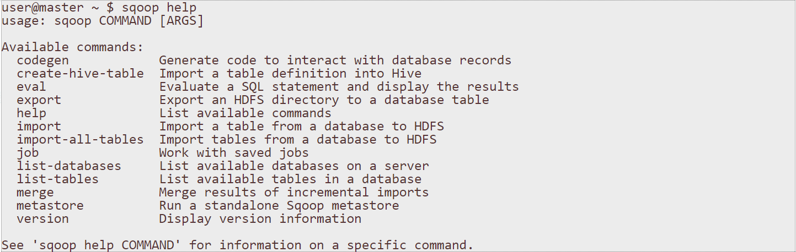
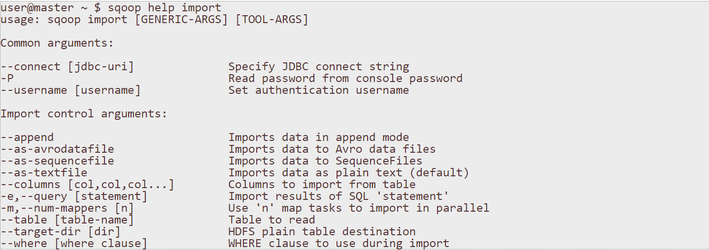

# Sqoop


### What is Sqoop ?

* Sqoop = SQL to Hadoop

* Sqoop 允許使用者從關聯式資料庫(RDBMS)中擷取資料到 Hadoop，供後續分析使用。

* Sqoop 也能將分析結果匯入資料庫，供其他用戶端程式使用。

### Sqoop 使用語法



### Sqoop Import 架構圖


### Sqoop Import 語法(1)



### Sqoop Import 語法(2)


### Sqoop Export 架構圖


### Sqoop Export 語法


# Sqoop 執行


### 讀取 Local MySQL 表格內容

* information_schema ： Local 端 的database
* root :  帳號
* mysql ：密碼

```
sqoop list-tables --connect jdbc:mysql://127.0.0.1/information_schema --username root --password mysql

```


### MySQL -> Sqoop -> HDFS

* TABLES : Local 端 的database
* -m 1  ： 限制 map 數量為 1 

```
sqoop import --connect jdbc:mysql://127.0.0.1/information_schema --username root --password mysql --table TABLES -m 1

```


### MySQL -> Sqoop -> HDFS(對外IP)

* 先給予資料庫權限
 *  develoer : 帳號
 
 *  114.33.6.9 : ip
 
 *  test : 密碼

```
mysql > create user 'developer'@'114.33.6.9' identified by 'test';


mysql >  grant all on *.* to 'developer'@'114.33.6.9';


mysql >  flush privileges ;


```

* 執行

```
sqoop import --connect jdbc:mysql://114.33.6.9/opendata2 --username developer --password test --table kind -m 1
```


### HDFS -> Sqoop -> MySQL
```
sqoop export --connect jdbc:mysql://127.0.0.1/mysql --username root --password mysql --table plugin --export-dir /user/hadoop/kin
```


### MySQL -> Sqoop -> Hive

* hive 內新增資料庫


```
create database test;
```


* 執行

```
sqoop import --connect jdbc:mysql://127.0.0.1:3306/information_schema --username root --password mysql --table TABLES --hive-import --hive-database test --hive-delims-replacement '\t' -m 1
```


* hive 內觀看結果

```
hive> show databases;

hive> use test;

hive> show tables;

hive> select * from tables;

```


### HDFS -> Sqoop -> HBase

```
sqoop import --connect jdbc:mysql://114.33.6.9/opendata2 --username developer --password test --table kind  --hbase-create-table --hbase-table student --column-family s_info --hbase-row-key index -m 1

```

### 參考

http://hive.3du.me/slide.html


