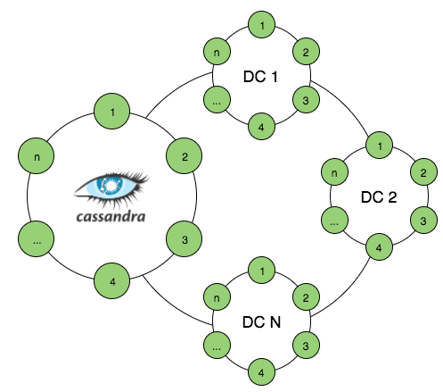

# Apache Cassandra 
Cassandra 是最初由 Facebook 開發，之後貢獻給 Apache 基金會維護的分散式 NoSQL 資料庫系統，一般被認為 Amazon Dyname 與 Google BigTable 的結合體，主要是分散性像 Dynamo，然而資料模型卻如 BigTable。目前有多家公司採用，可運行上千台節點來提供超過 200 TB 的資料。

Cassandra 擁有幾個特點，也因為這些特點讓許多人選擇使用該資料庫，以下幾個項目簡單列出其特點：
* 完全去中心化，且不是主從架構的備份
* 統一類型的節點
* 以 P2P 協定串連起網路，清除 SPOF（Single Point Of Failure）問題
* 高擴展性，新增與刪除節點容易
* 可呼叫的一致性，並支援強一致性與弱一致性
* 支援跨區域的叢集架構
* 每個區域儲存一份完整資料，來提供存取局部性、容錯與災難復原
* **寫入效能理論上比讀取好（但近期有證實現在讀取也很不錯），適合串流資料儲存**
* 比 HBase 的隨機存取效能要好上許多，但不擅長區間掃描
* 可作為 HBase 的即時查詢快取。

<center> 

若要瞭解更多 Cassandra 可以閱讀 [Cassandra Wiki
](http://wiki.apache.org/cassandra/GettingStarted)。

## 安裝
本節將安裝一個簡單的 Cassandra 叢集，來提供 NoSQL 資料庫以存取資料，以下為節點配置：

| IP Address  |   HostName   | 
|-------------|--------------|
|172.17.0.2   |  cassandra-1 |
|172.17.0.3   |  cassandra-2 |
|172.17.0.4   |  cassandra-3 |

首先需在每個節點安裝 Java，這邊採用 Oracle 的 Java 來進行安裝：
```sh
$ sudo apt-get install -y software-properties-common 
$ sudo add-apt-repository -y ppa:webupd8team/java
$ sudo apt-get update
$ echo debconf shared/accepted-oracle-license-v1-1 select true | sudo debconf-set-selections
$ echo debconf shared/accepted-oracle-license-v1-1 seen true | sudo debconf-set-selections
$ sudo apt-get -y install oracle-java7-installer
```
> 若要安裝```java8```請修改成```oracle-java8-installer```。

接著在各節點安裝 Cassandra 套件，這邊採用```apt-get```安裝，首先加入 Repository：
```sh
$ echo "deb http://www.apache.org/dist/cassandra/debian 22x main" | sudo tee -a /etc/apt/sources.list.d/cassandra.sources.list  
```
> 這邊安裝```2.2.x```版本，若要其他版本則修改```22x```，如改為```21x```。

為了避免軟體套件更新軟體時有簽證警告，需加入 Apache 基金會與套件資源庫相關的三個公有金鑰：
```sh
$ gpg --keyserver pgp.mit.edu --recv-keys F758CE318D77295D
$ gpg --export --armor F758CE318D77295D | sudo apt-key add -
$ gpg --keyserver pgp.mit.edu --recv-keys 2B5C1B00
$ gpg --export --armor 2B5C1B00 | sudo apt-key add -
$ gpg --keyserver pgp.mit.edu --recv-keys 0353B12C
$ gpg --export --armor 0353B12C | sudo apt-key add -
```

完成後更新 apt-get Repository：
```sh
$ sudo apt-get update
```

安裝 Cassandra NoSQL 於每個節點上：
```
$ sudo apt-get install -y cassandra
```

完成後，我們必須開始配置各節點來組成一個叢集，先把每個節點的 Cassandra 服務關閉：
```sh
$ sudo service cassandra stop 
```

關閉後，在每個節點編輯```/etc/cassandra/cassandra.yaml```檔案，並修改一下內容：
```sh
cluster_name: 'examples'  
num_tokens: 256  
seed_provider:  
    - class_name: org.apache.cassandra.locator.SimpleSeedProvider
      parameters:
          - seeds: "172.17.0.2, 172.17.0.3, 172.17.0.4"

listen_address: 172.17.0.2  
broadcast_address: 172.17.0.2 
rpc_address: 0.0.0.0  
broadcast_rpc_address: 172.17.0.2 
```
> P.S. 這邊要注意不同節點會有不同，如```listen_address```與```seeds```等。

都完成設定檔後，就可以重啟每台的 Cassandra 服務：
```sh
$ sudo service cassandra restart
```

當確認所有節點重新啟動後，在```其中一個節點```建立 keyspaces 來做 replication：
```sh
$ cqlsh
cqlsh> create keyspace Spark_smack WITH REPLICATION = { 'class' : 'SimpleStrategy', 'replication_factor' : '3' };  
exit 
```
> ```Spark_smack``` 該值是可以依個人名稱修改。

建立完成後，可以使用```nodetool```指令來檢查是否成功：
```sh
$ nodetool status spark_smack

Datacenter: datacenter1
=======================
Status=Up/Down
|/ State=Normal/Leaving/Joining/Moving
--  Address     Load       Tokens       Owns (effective)  Host ID                               Rack
UN  172.17.0.3  255.68 KB  256          100.0%            9c9eb117-f787-47bd-825f-3daf49eba489  rack1
UN  172.17.0.2  252.03 KB  256          100.0%            7a4adb77-42d1-402f-b57b-4a40ad013e2c  rack1
UN  172.17.0.4  127.2 KB   256          100.0%            5823fd78-45f2-4328-9470-f1053bb3fc3b  rack1
```

## 驗證系統
我們透過 Client 程式來連到```cassandra-1```節點來驗證叢集是否建立成功：
```sh
$ cqlsh 
cqlsh> use <keyspace name>;
```
> 這邊```<keyspace name>```範例為 spark_smack。

然後建立一個資料表：
```sql
CREATE TABLE emp(  
   emp_id int PRIMARY KEY,
   emp_name text,
   emp_city text,
   emp_sal varint,
   emp_phone varint
   );
```

接著插入一筆資料到資料表：
```sql
INSERT INTO emp (emp_id, emp_name, emp_city )  
  VALUES(1, 'Kyle', 'Taichung' );
```

若都沒有任何錯誤的話，現在連接到其他節點來檢查是否有同步資料：
```sh
$ cqlsh
cqlsh> use spark_smack;
cqlsh> select * from emp;

 emp_id | emp_city | emp_name | emp_phone | emp_sal
--------+----------+----------+-----------+---------
      1 | Taichung |     Kyle |      null |    null
      
```
> P.S 若發生如以下錯誤，請依照指示解決：
```sh
Connection error: ('Unable to connect to any servers', {'127.0.0.1': error(111, "Tried connecting to [('127.0.0.1', 9042)]. Last error: Connection refused")})
```

> 首先檢查設定檔```/etc/cassandra/cassandra.yaml```裡面的```rpc_address```是否為```0.0.0.0```。

最後，若要復原與備份可以閱讀 [Cassandra Backup and Recovery](http://blog.powerupcloud.com/2015/09/13/cassandra-backup-and-recovery/)。

## 參考資源
* [Cassandra简介](https://www.byvoid.com/blog/cassandra-intro)
* [Install and Configure a 3 node Cassandra Cluster on Ubuntu 14.04](http://blog.powerupcloud.com/2016/01/10/install-and-configure-a-3-node-cassandra-cluster-on-ubuntu-14-04/)
* [關於 Cassandra 的錯誤觀點](http://www.infoq.com/cn/articles/cassandra-mythology)