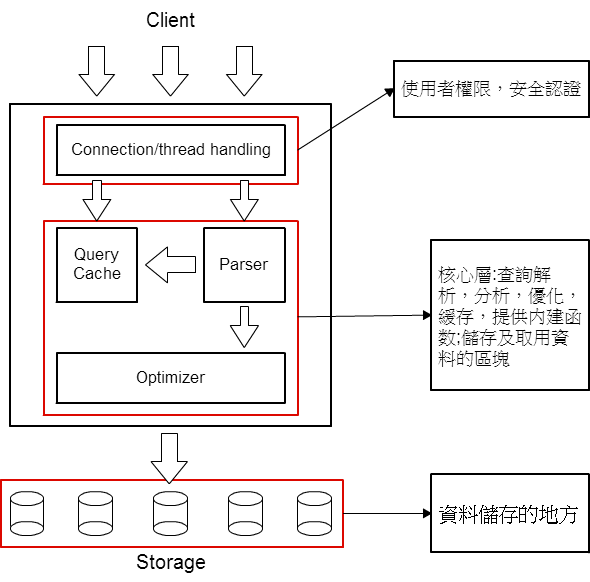

#MySQL

MySQL 資料庫系統是開放原始碼的關聯式資料庫管理系統(Relational Database management system, RDBMS)，是一種針對資料庫，為了管理資料庫而設計的軟體控管系統。

原開發公司是瑞典的MySQL AB，該公司於2008年被昇陽微系統收購，隔年昇陽微系統公司被甲骨文公司（Oracle）收購，於是MySQL成為Oracle旗下的產品。

在目前許多大規模網站都採用,像是維基百科、Google和Facebook等......。

##架構圖

<center> 

##安裝指令
先更新資源庫，並安裝 mysql:
```sh
$sudo apt-get update
$sudo apt-get install mysql
```

###安裝資料庫管理工具

若要安裝圖形化資料庫管理工具，請安裝 phpMyAdmin，安裝步驟如下

Step 1:更新資源庫，並安裝 phpMyAdmin
```sh
$sudo apt-get update
$sudo apt-get install phpmyadmin
```

Step 2:選擇安裝 apache2，並輸入帳號及密碼

Step 3:進入 /etc/apache2/apache2.conf 檔案，並增加以下配置
```sh
# phpMyAdmin Configuration

Include /etc/phpmyadmin/apache.conf
```

Step 4:開啟 apache2 服務
```sh
$sudo apache2 restart
```


