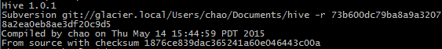

# Hive

### What is Hive ?

* 它提供了一系列的工具，可用來對數據進行存取/轉化/讀取(ETL);

* 是一種可以儲存、查詢和分析儲存在HDFS(或者HBase)中的大規模數據機制

* 可用SQL語法存取Hadoop資料，另外查詢是透過MapReduce來完成的

### 簡介 

Hive是建置在HDFS上的一套分散式資料倉儲系統，可讓使用者以慣用的SQL語法，來存取Hadoop檔案中的大型資料集，例如可以使用Join、Group by、Order by等，而這個語法稱為Hive QL。不過，Hive QL和SQL並非完全相同，例如Hive就不支援Store Procedure、Trigger等功能。


Hive會將使用者輸入的Hive QL指令編譯成Java程式，再來存取HDFS檔案系統上的資料，所以，執行效率依指令複雜度和處理的資料量而異，可能有數秒鐘，甚至是數分鐘的延遲。和HBase相比，Hive容易使用且彈性高，但執行速度較慢。不少資料庫系統，都是透過先連結到Hive，才能與Hadoop整合。例如微軟就是透過Hive ODBC驅動程式，將SQL指令轉換成Hive QL，讓Excel可以存取Hadoop上的資料。


### 安裝步驟

首先利用 ```curl``` 下載，並解壓縮到 ```/opt/``` 下

```sh
$ sudo curl -s http://archive.apache.org/dist/hive/hive-1.0.1/apache-hive-1.0.1-bin.tar.gz | sudo tar -xz -C /opt/
$ sudo mv /opt/apache-hive-1.2.1-bin/ /opt/hive
```

然後設定環境變數

```sh
$ export HIVE_HOME=/opt/hive
$ export PATH=$PATH:$HIVE_HOME/bin
```

最後可用這行指令檢查是否有安裝成功

```sh
$ hive --version
```

成功後會出現以下輸出:



### Hive Shell

*  建立一個名為 KeyValue 的 table，兩個欄位: key (型態 int) 與 value (型態 string)
 
  * 跟 SQL 一樣不分大小寫
  * 並以分號(;)當作作指令的結束
  * 可用 drop table keyvalue; 來刪除這個 table


```
hive> CREATE TABLE KeyValue (key INT, value STRING); 
```


* 看看 KeyValue 表格是否已經被建立起來

  * describe keyvalue 來查看表格


```
hive> show tables;
```


*  將範例資料匯入 keyvalue

   *  load data "local" inpath 這段指令裡的 local 表示使用本機檔案，若沒有 local，則是讀取 HDFS 的檔案。  
   *  如果沒有 orverwrite 參數，資料是以 append 方式匯入表格。 
   *  $HIVE_HOME/examples 底下有一堆範例資料
   

```
hive> load data local inpath '/home/hadoop/hive-0.7.1/examples/files/kv3.txt' overwrite into table KeyValue;
```

* 查詢 KeyValue 全部資料

  * 比較一下範例資料與查詢的結果有何不同 (空的 raw data 進 table 後會變為 null)

```
hive> select * from keyvalue;
```


* 加入查詢條件

  * 啟動了 hadoop MapReduce 運算。
  * 可以設定參數，比如 mapred.reduce.tasks=<number> 
  * 預設的參數設定在: $HIVE_HOME/conf/hive-default.xml，之後這些參數可以在 $HIVE_HOME/conf/hive-site.xml 修改
  * hive 使用 log4j，設定檔在 $HIVE_HOME/conf/hive-log4j.properties

```
hive> select * from keyvalue where key>200 order by key desc;

```


### 使用 xpath 來查詢 JSON 格式的資料

* 
首先建立一個只有單一欄位的表格，並匯入範例檔案 json.txt 的資料

**json.txt**
```
{
 "store":
  {"fruit":\[{"weight":8,"type":"apple"},{"weight":9,"type":"pear"}],
   "bicycle":{"price":19.95,"color":"red"}
  },
 "email":"amy@only_for_json_udf_test.net",
 "owner":"amy"
}
```

```
hive> create table json_table (col string);

hive> LOAD DATA LOCAL INPATH '/home/hadoop/hive-0.7.1/examples/files/json.txt' OVERWRITE INTO TABLE json_table;

```
* 
查詢 json 資料


```
hive> SELECT * from json_table;

hive> SELECT get_json_object(json_table.col, '$.owner') FROM json_table;

```

```

hive> SELECT get_json_object(json_table.col, '$.store.fruit\[0]') FROM json_table;

hive> SELECT get_json_object(json_table.col, '$.non_exist_key') FROM json_table;

```


### 參考

http://www.ithome.com.tw/node/73980

http://blog.myfs.co/2011/11/hadoop-apache-hive-install-run-json.html


