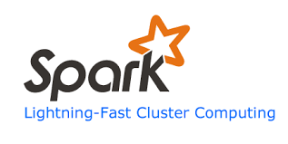
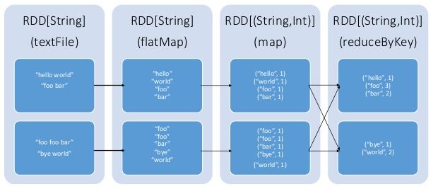

# Apache Spark
它是一個快速的群集計算系統，它具備了幾個特色，首先，它和Apache Hadoop相容，這意思是說，它支援了Hadoop所支援的儲存系統，包括HDFS、S3、……等等。這些儲存系統，可以說是當前在處理大規模資料時，開發者所慣以使用的儲存系統了，因此，Spark 同樣立足於這些儲存系統之上。

Spark透過一個以分散式記憶體為主的計算模型，來大幅提高計算效率，因此在100TB級的資料排序上，Spark展現了它的計算高效率。另一方面，Spark 提供了豐富而且易用的API，這使得開發者在利用程表述計算邏輯時，得以獲得API層次的支持，如此，一來更容易撰寫程式，二來也能有效降低所需的程式碼行數

開發者可以利用三種程式語言來開發Spark 之上的應用程式，包括了**Scala**、**Python**，以及 **Java**，這代表著開發者可以視應用的情境，來決定使用何種語言來撰寫Spark程式，更能彈性的符合開發時的需求。

### 核心技術RDD
Spark的核心支柱，乃是一個名為RDD（Resilient Distributed Dataset）的分散式計算模型，而其諸多優勢，主要也是源自於RDD本身的特性。

所謂的RDD，乃是由AMPLab實驗室所提出的概念，類似一種分散式的記憶體。而且，RDD是一種可跨群集（cluster）被使用、可儲存於主記憶體中的immutable的物件集合。這裡所謂的immutable物件，乃是指在被產生之後，其狀態便無法被修改的物件。

在RDD之上，可以施加兩類型的操作，一種稱為「轉換（Transformation）」，另一種則為「動作（Action）」。其中，所謂的「轉換」，其操作結果為新的RDD，意即其作用在於將RDD再轉換生成另一個RDD。而所謂的「動作」，則是在RDD之上進行計算之後，將其結果返回 Spark 的驅動程序，或寫至檔案系統。

